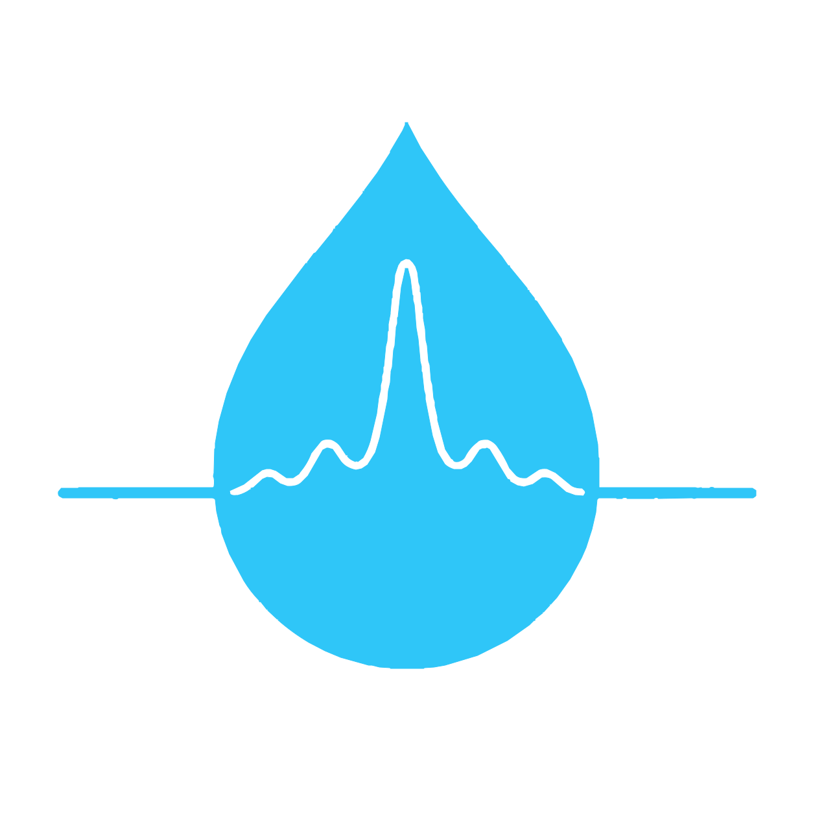

# Microdroplet Spectrum Analyzer

<p align="center">
  
</p>

<p align="center">
  Desktop signal analysis for microdroplet spectrum and microfluidic optical data.
</p>

<p align="center">
  <a href="README.zh-CN.md">简体中文</a>
</p>

[](https://www.python.org/)
[](https://doc.qt.io/qtforpython-6/)
[](https://numpy.org/)
[](https://pandas.pydata.org/)
[](https://scipy.org/)
[](https://matplotlib.org/)
[](LICENSE)

## Overview

Microdroplet Spectrum Analyzer is a lightweight Python desktop application for importing, preprocessing,
detecting, reviewing, and exporting microdroplet spectrum or signal measurements. It is designed for lab
workflows where researchers need to quickly inspect droplet-related optical signals, identify stable plateau
segments or traditional peaks, compare signal statistics, and export reproducible result tables and figures.

The core signal-processing code lives in `spectrum_signal_app/` and is separated from the PySide6 interface
through request and result dataclasses. This keeps the analysis model easier to maintain while allowing the GUI
to provide fast preview plots, parameter controls, threaded analysis, and export-quality chart rendering.

## Features

- Import `.csv`, `.xlsx`, and `.xls` data files with selectable signal and optional time columns.
- Analyze signals in two modes: plateau detection by threshold interval, or peak detection through
  `scipy.signal.find_peaks`.
- Preprocess data with percentile clipping, median filtering, Savitzky-Golay smoothing, and manual baseline
  correction.
- Automatically suggest plateau thresholds and length limits from the current signal.
- Preview large signals interactively with `pyqtgraph`.
- Render export-ready charts with Matplotlib.
- Export detection tables to Excel and charts to PNG or SVG.
- Keep the interface responsive with debounced, threaded analysis.
- Disable real-time refresh automatically for very large datasets.
- Launch on Windows through `start.bat` without leaving a visible console window.

## Project Status

| Item | Current State |
| --- | --- |
| Application type | PySide6 desktop application |
| Main package | `spectrum_signal_app` |
| Public source files | 10 Python files |
| Input formats | `.csv`, `.xlsx`, `.xls` |
| Export formats | `.xlsx`, `.png`, `.svg` |
| License | MIT |
| Repository | `https://github.com/MIGO-OvO/microdroplet-spectrum-analyzer` |

## Quick Start

### 1. Clone the repository

```powershell
git clone https://github.com/MIGO-OvO/microdroplet-spectrum-analyzer.git
cd microdroplet-spectrum-analyzer
```

### 2. Create and activate a virtual environment

```powershell
python -m venv .venv
.\.venv\Scripts\Activate.ps1
python -m pip install --upgrade pip
```

If PowerShell blocks activation scripts, run this in the same terminal session and activate again:

```powershell
Set-ExecutionPolicy -Scope Process -ExecutionPolicy Bypass
```

### 3. Install dependencies

```powershell
pip install -r requirements.txt
```

### 4. Run the application

Recommended package entry point:

```powershell
python -m spectrum_signal_app
```

Compatibility launcher:

```powershell
python main.py
```

Windows no-console launcher:

```powershell
.\start.bat
```

## Basic Workflow

1. Load a CSV or Excel data file.
2. Select the signal column and, optionally, a time column.
3. Choose plateau detection or peak detection mode.
4. Adjust preprocessing and detection parameters.
5. Use automatic plateau suggestions when threshold setup needs a quick starting point.
6. Review the preview chart, export chart, statistics panel, and result table.
7. Export the result table as Excel or export the chart as PNG/SVG.

## Analysis Model

The analyzer uses small dataclasses to make each analysis run explicit:

| Dataclass | Responsibility |
| --- | --- |
| `PreprocessParams` | Filter mode, smoothing windows, clipping percentile, and baseline correction |
| `PlateauParams` | Threshold range, minimum/maximum plateau length, and edge deviation limit |
| `PeakParams` | Peak height, distance, and prominence parameters |
| `AnalysisRequest` | Complete immutable request for one analysis run |
| `AnalysisResult` | Processed signal, detected features, statistics, warnings, and cache state |

## Repository Structure

```text
microdroplet-spectrum-analyzer/
|-- asset/
|   `-- LOGO.svg                 # Project logo used by the README files
|-- spectrum_signal_app/
|   |-- __init__.py              # Matplotlib Qt backend setup
|   |-- __main__.py              # Enables python -m spectrum_signal_app
|   |-- app.py                   # QApplication startup
|   |-- analyzer.py              # Signal preprocessing and feature detection
|   |-- canvas.py                # Matplotlib canvas wrapper
|   |-- config.py                # Default parameters and plot style constants
|   |-- dialogs.py               # Data/time column selection dialog
|   `-- main_window.py           # Main PySide6 interface
|-- config.py                    # Compatibility re-export for package config
|-- main.py                      # Compatibility launcher
|-- requirements.txt             # Runtime dependencies
|-- start.bat                    # Windows no-console launcher entry
|-- start_hidden.vbs             # Starts pythonw.exe with the package entry point
|-- LICENSE                      # MIT license
|-- README.md                    # English README
`-- README.zh-CN.md              # Simplified Chinese README
```

## Quality Check

Run a syntax compile check before publishing changes:

```powershell
python -m py_compile main.py config.py spectrum_signal_app\*.py
```

## Dependencies

| Dependency | Purpose |
| --- | --- |
| PySide6 | Qt desktop user interface |
| pyqtgraph | Fast interactive signal preview |
| Matplotlib | Export-quality chart rendering |
| NumPy | Numeric arrays and vectorized operations |
| Pandas | CSV/Excel loading and Excel export |
| SciPy | Signal filtering and peak detection |

## Reporting Issues

Found a bug, confusing behavior, or an analysis case that does not look right?
Please open an issue at:

[GitHub Issues](https://github.com/MIGO-OvO/microdroplet-spectrum-analyzer/issues)

Include the input format, selected columns, analysis mode, parameter values, and screenshots when they help
explain the problem.

## License

This project is licensed under the [MIT License](LICENSE).

## Acknowledgements

This project builds on:

- [Python](https://www.python.org/) for the application runtime.
- [Qt for Python / PySide6](https://doc.qt.io/qtforpython-6/) for the desktop interface.
- [NumPy](https://numpy.org/), [Pandas](https://pandas.pydata.org/), and [SciPy](https://scipy.org/) for data and
  signal processing.
- [pyqtgraph](https://www.pyqtgraph.org/) for responsive plotting of large signal arrays.
- [Matplotlib](https://matplotlib.org/) for publication-friendly chart export.
